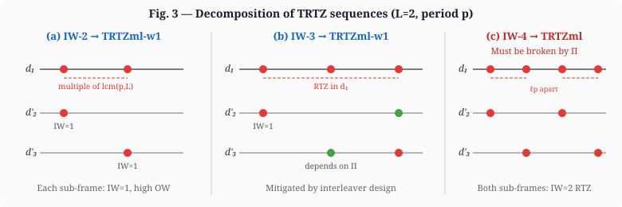
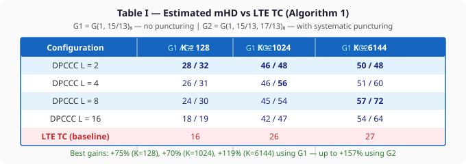

# DPCCC-Toolkit

A complete open-source toolkit for the design and simulation of
**Decomposed Parallel Concatenated Convolutional Codes (DPCCC)**,
a novel turbo code architecture that significantly increases the minimum
Hamming distance (mHD) and reduces the error floor compared to
conventional turbo codes such as LTE.

**Code:** https://github.com/bazzal99/DPCCC-Toolkit

---

## Paper

> M. Bazzal, J. Nadal, S. Weithoffer, C. A. Nour and C. Douillard,
> **"A Novel Parallel Concatenated Convolutional Code Structure Based on Frame Decomposition,"**
> *2025 13th International Symposium on Topics in Coding (ISTC)*,
> Los Angeles, CA, USA, 2025, pp. 1–5.
> DOI: [10.1109/ISTC65386.2025.11154568](https://doi.org/10.1109/ISTC65386.2025.11154568)
> Preprint: [hal-05168399](https://imt-atlantique.hal.science/hal-05168399v1)

---

## What is a DPCCC?

A DPCCC encodes a K-bit information block **d₁** through:

1. **Encoder C₁** (tail-biting RSC, length K) → first parity stream of length K
2. **L independent encoders** C₂…C_{L+1} (tail-biting RSC, each length K/L),
   each receiving an interleaved sub-frame **d'_q** formed by selecting
   every L-th bit of **d₁** according to the rule:

   ```
   d'_q[ℓ] = d₁[ℓ·L + q − 2],   ∀ ℓ < K/L − 1,   q ∈ [2, L+1]
   ```

The overall code rate is **1/3** (K systematic + K first parity + K total sub-block parity),
matching conventional turbo codes while achieving significantly higher mHD.

### DPCCC Structure


### Key idea: suppressing low-IW TRTZ sequences

In conventional TCs the number of IW-2 TRTZ sequences grows **quadratically** with K
(K·⌊K/p⌋ sequences for period p). DPCCC mitigates this by decomposing the frame:
when L mod p ≠ 0, IW-2 single-layer TRTZ sequences are reduced to K·⌊K/lcm(p,L)⌋,
and IW-2/IW-3 multi-layer sequences are converted into high-weight TRTZml-w1 sequences.

### TRTZ Sequence Decomposition



The three cases from the paper:
- **(a) IW-2** → splits into two IW-1 sub-frame sequences → high output weight → **mitigated**
- **(b) IW-3** → similar split, depends on interleaver for suppression → **mitigated by design**
- **(c) IW-4** → both sub-frames carry IW-2 RTZ sequences → **must be broken by Π**

---

## mHD Results

### Estimated mHD vs LTE TC (from Table I of the paper)



**Configuration:** Algorithm 1, code rate R = 1/3, G1 = G(1, 15/13)₈,
G2 = G(1, 15/13, 17/13)₈ with systematic puncturing pattern [10100000]
and parity patterns [11101111] / [01011010].

| Config | K=128 G1/G2 | K=1024 G1/G2 | K=6144 G1/G2 |
|--------|------------|-------------|-------------|
| DPCCC L=2 | **28** / **32** | **46** / 48 | 50 / 48 |
| DPCCC L=4 | 26 / 31 | **46** / **56** | 51 / 60 |
| DPCCC L=8 | 24 / 30 | 45 / 54 | **57** / **72** |
| DPCCC L=16 | 18 / 19 | 42 / 47 | 54 / 64 |
| **LTE TC** | **16** | **26** | **27** |

Best gains over LTE: **+75%** (K=128), **+70%** (K=1024), **+119%** (K=6144) using G1,
and **+100%**, **+107%**, **+157%** using G2.

---

## Repository structure

```
DPCCC-Toolkit/
├── shared/                         ← Shared code used by all three tools
│   ├── config.h                    ← ALL tunable parameters (edit this first)
│   ├── encoder.h / encoder.c       ← Multi-segment tail-biting RSC encoder
│   ├── interleaver.h / interleaver.c  ← ARP interleaver + repetition mapping
│   ├── decoder.h / decoder.c       ← Log-MAP (BCJR) decoder
│   └── utils.h / utils.c           ← Binary ops, AWGN, sorting, file I/O
│
├── interleaver_design/
│   ├── decoder_free/               ← Tool 1: decoder-free mHD design (Algorithm 1)
│   │   ├── include/
│   │   │   ├── design_config.h     ← Threshold, RTZ search depth
│   │   │   ├── rtz_search.h        ← DPCCC-aware RTZ graph-girth kernel
│   │   │   └── designer.h          ← Layer-by-layer ARP design
│   │   ├── src/
│   │   │   ├── main.c
│   │   │   ├── designer.c
│   │   │   └── rtz_search.c
│   │   └── Makefile
│   │
│   └── double_impulse/             ← Tool 2: N-impulse decoder-based design (DIM/EVIM)
│       ├── include/
│       │   ├── design_config.h     ← IMPULSE_N (1/2/3), threshold, SNR
│       │   └── designer.h          ← Threaded impulse method
│       ├── src/
│       │   ├── main.c
│       │   └── designer.c
│       └── Makefile
│
├── montecarlo/                     ← Tool 3: BER/FER Monte Carlo simulator
│   ├── include/sim_config.h        ← RNG seed, target frame errors
│   ├── src/main.c
│   └── Makefile
│
└── docs/figures/                   ← Paper figures (SVG)
    ├── dpccc_structure.svg
    ├── trtz_sequences.svg
    └── mhd_table.svg
```

---

## Configuration

All shared parameters are in **`shared/config.h`**. The most important ones:

```c
#define SIZE      1024   /* Information block length K                      */
#define CUTS      2      /* Number of decompositions L (parity sub-blocks)  */
#define ARP_Q     4      /* ARP sub-interleaver period Q                    */
#define DELAYS    3      /* RSC memory elements (2^DELAYS trellis states)   */
#define G1_INIT   {1,1,0,1}   /* RSC feedforward polynomial G1             */
#define G2_INIT   {1,0,1,1}   /* RSC feedback polynomial G2                */
#define ENCODER_PERIOD  7     /* RSC impulse response period (7 for LTE)   */
```

### Selecting L (number of decompositions)

The paper provides clear guidance (Section IV-C):

- **L mod p ≠ 0** is required (do not use L that is a multiple of the encoder period p=7)
- Small L is preferred for short frames; larger L benefits large frames
- Recommended values from Table I: **L=2** for K≤1024, **L=8** for K=6144

---

## Tool 1: Decoder-free interleaver design (Algorithm 1 from paper)

Implements the iterative coordinate-descent design of Section IV-E,
using the decoder-free RTZ graph-girth search from [7] as the distance oracle.
Each sub-interleaver Πq is designed sequentially, conditioned on all
previously designed interleavers Π₂…Π_{q-1}.

```bash
cd interleaver_design/decoder_free
# Edit include/design_config.h: set DESIGN_THRESHOLD, IWM_MAX_WEIGHT, etc.
make
./dpccc_decoder_free
```

**Output** (`result.txt`) — C-initialiser format:
```c
int total_S[2][4] = { {1, 3, 7, 2}, {0, 5, 4, 1} };
int total_P[2]    = {11, 7};
distance = 46
```

---

## Tool 2: N-impulse interleaver design (DIM / EVIM variant)

Evaluates ARP candidates by injecting **N simultaneous high-LLR impulses**
into the turbo decoder (N=1: SIM, N=2: DIM, N=3: triple). Set `IMPULSE_N`
in `include/design_config.h`. Parallelised across all CPU cores via pthreads.

```bash
cd interleaver_design/double_impulse
# Edit include/design_config.h: set IMPULSE_N (1/2/3), DESIGN_THRESHOLD, IMPULSE_SNR
make
./dpccc_impulse
```

---

## Tool 3: Monte Carlo BER/FER simulator

Simulates BER and FER over AWGN using log-MAP decoding with
`MAX_ITERATIONS` turbo iterations. The interleaver is loaded from
`ARP_SEMI_Initialization()` in `shared/interleaver.c` — update the
hardcoded S[], P arrays there with your designed interleaver.

```bash
cd montecarlo
# Edit shared/config.h: SNR_MIN, SNR_MAX, SNR_STEP, MAX_ITERATIONS
# Edit shared/interleaver.c: update ARP_SEMI_Initialization() with your S, P
make
./dpccc_sim
```

**Output** (`result.txt`):
```
SNR = 2.00
BER = [1.2340000e-02, 3.4560000e-03, ...]
FER = [4.5670000e-02, 1.2340000e-02, ...]
```

> **Performance note:** The simulator is single-threaded. For large K or
> high SNR (deep waterfall / error floor), parallelise `Build_SNR()` with
> pthreads — the loop structure is already designed for it.

---

## Building

Each tool builds independently:

```bash
# Tool 1
cd interleaver_design/decoder_free && make

# Tool 2
cd interleaver_design/double_impulse && make   # requires pthreads

# Tool 3
cd montecarlo && make
```

Requires: GCC with C99 support, `libm`. Tool 2 additionally requires `-lpthread`.

Clean all:
```bash
make clean   # run inside each tool directory
```

---

## RSC encoder notes

Two encoder configurations are used in the paper:

| Name | Generator | Puncturing | Notes |
|------|-----------|-----------|-------|
| G1 | G(1, 15/13)₈ | none | Single-parity RSC |
| G2 | G(1, 15/13, 17/13)₈ | data: [10100000], parity₁: [11101111], parity₂: [01011010] | Double-parity RSC with systematic puncturing |

Set in `shared/config.h` via `G1_INIT`, `G2_INIT`, and the `PUNCT_*` defines.

---

## License

MIT License. See [LICENSE](LICENSE).  
Copyright © 2025 Mohammad Bazzal, IMT Atlantique, Lab-STICC, Brest, France.

---

## Citation

```bibtex
@inproceedings{bazzal2025dpccc,
  author    = {Bazzal, Mohammad and Nadal, J{\'e}r{\'e}my and Weithoffer, Stefan
               and {Abdel Nour}, Charbel and Douillard, Catherine},
  title     = {A Novel Parallel Concatenated Convolutional Code Structure
               Based on Frame Decomposition},
  booktitle = {2025 13th International Symposium on Topics in Coding (ISTC)},
  address   = {Los Angeles, CA, USA},
  pages     = {1--5},
  year      = {2025},
  doi       = {10.1109/ISTC65386.2025.11154568}
}
```

---

## Related repository

The decoder-free mHD estimation method used by Tool 1 is also available
as a standalone tool for LTE turbo codes:

**[Decoder-Free-Turbo-mHD_Estimator](https://github.com/bazzal99/Decoder-Free-Turbo-mHD_Estimator)**
